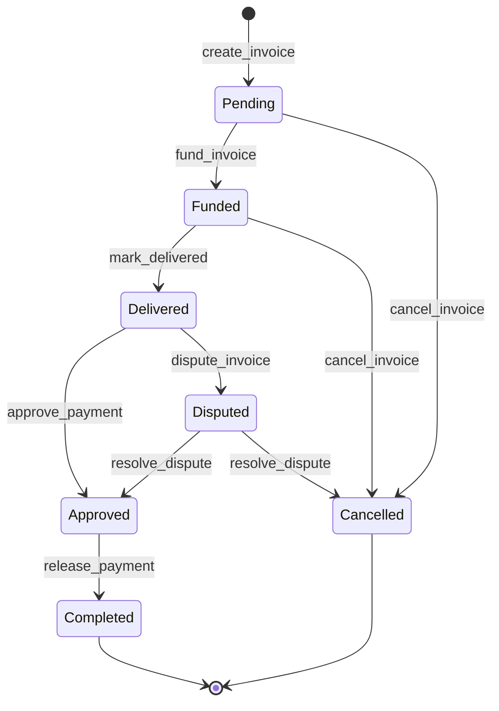

# StarInvoice

An invoice-based escrow protocol for freelancers, built on [Stellar](https://stellar.org) using [Soroban](https://soroban.stellar.org) smart contracts.

## Overview

StarInvoice lets freelancers create on-chain invoices and receive payment through a trustless escrow flow. The client funds the invoice, the freelancer marks work as delivered, and funds are released upon approval — no intermediaries needed.

## Status

This project is intentionally minimal. The `create_invoice` function is implemented. All other escrow functions are stubbed with `TODO` comments and open GitHub issues for contributors to pick up.

## Contract Flow

```
create_invoice → fund_invoice → mark_delivered → approve_payment → release_payment
```

### State Machine



> Note: `Disputed` and `Cancelled` states are planned — see [issue #5](https://github.com/your-org/StarInvoice/issues/5).

| Function          | Status        |
|-------------------|---------------|
| `create_invoice`  | ✅ Implemented |
| `fund_invoice`    | 🚧 TODO        |
| `mark_delivered`  | ✅ Implemented |
| `approve_payment` | 🚧 TODO        |
| `release_payment` | ✅ Implemented |

## Project Structure

```
contracts/
  invoice/
    src/
      lib.rs       # Contract entry point and function definitions
      storage.rs   # Invoice data structures and on-chain storage helpers
      events.rs    # Contract event emitters
```

## Prerequisites

- [Rust](https://www.rust-lang.org/tools/install) (stable)
- [Soroban CLI](https://soroban.stellar.org/docs/getting-started/setup)

```bash
cargo install --locked soroban-cli
```

## Build

```bash
cargo build --target wasm32-unknown-unknown --release
```

## Test

```bash
cargo test
```

## Contributing

See [CONTRIBUTING.md](./CONTRIBUTING.md) for how to get involved.

## License

MIT
